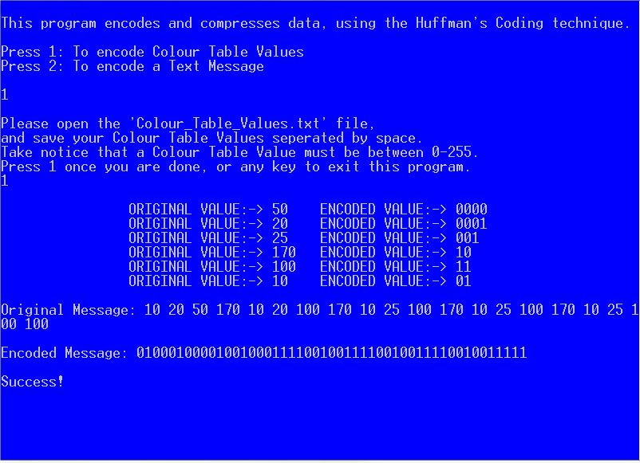
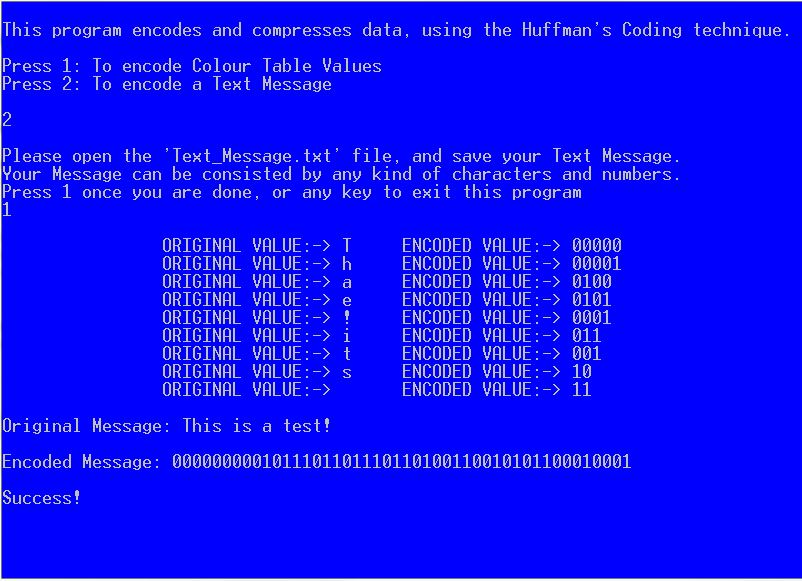

# Huffman_Coding

This complex <b>C</b> Program encodes and compresses data dynamically, using the Huffman's Coding technique. You can either encode Colour Table Values (<b>Digital Image Processing</b>) or just any text message of your desire.  
 
 
1) To run this program, double-click the HuffmanCoding.exe file.  
2) Follow the instuctions and use your inputs.  
3) Notice that you can use the examples given, as inputs for testing.  

- December 2015, Serres, Greece
- Nikiforos Archakis

<table>
 	<tr>
		<td></td>
		<td></td>
	</tr>
</table>
